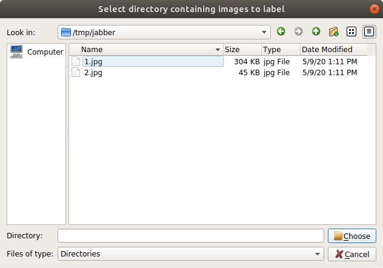
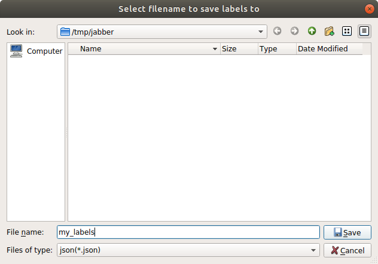
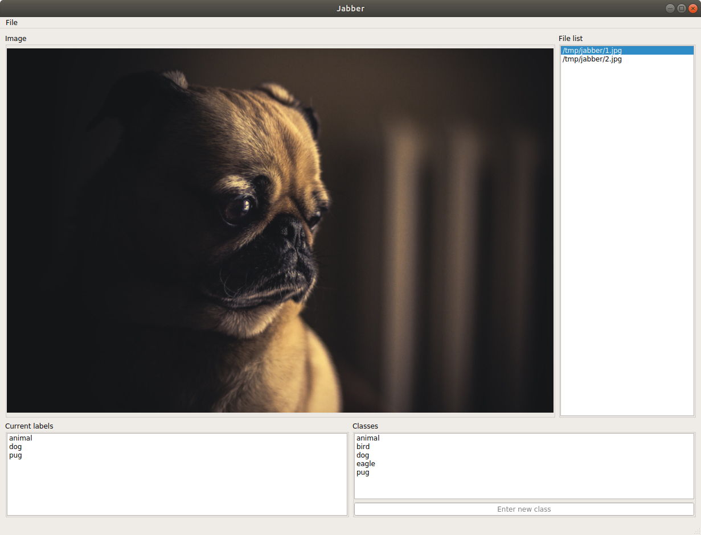
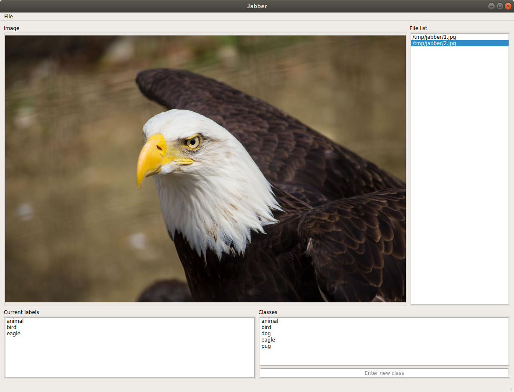

# jabber
Label single or multiclass data with minimal keystrokes

### Prerequisites
You need Python >= 3.6 and PyQt5 to run jabber

To install PyQt5 with pip:
```bash
pip install PyQt5
```
If you plan to run the unit tests in this project, you may also want pytest:
```bash
pip install pytest
```

## Running
```bash
# navigate to the top level of this repo (the same level as README.md)
cd jabber

# run jabber.py
python jabber.py
```

## Running tests
If you want to run the unit tests associated with this project, you should first install jabber:
```bash
python setup.py install
```
Then you can run the tests with:
```bash
pytest tests
```

## Quick overview
### Loading files and labels
To load a group of images, go to `File->Open` and select a directory that contains images (not recursively searched).




When you try to create your first class, you will be prompted to choose a file to save the labels to.  Simply 
type the filename you wish to use (e.g. `my_labels`) and all labels you create will be automatically saved here as JSON.



If you want to load existing labels, or to set your labels file before creating a class, you can go to `File->Select labels file`
and choose your new or preexisting labels file `my_labels.json`.  Existing labels will not be overwritten if you choose to 
reload a file, but if you delete classes or labels, these changes will be reflected in the file.

### Labeling
The main purpose of jabber is to speed up classification labeling/data separation by allowing the user to establish the 
classes they want, then associating those classes with each image using the minimum number of keystrokes.  
This is done by matching keystrokes typed by the user to the existing class list.

For example, if you wanted to label pictures at the levels `<major type>, <minor type>, <specific descriptor>`, you would 
first add some classes in the `Classes` text entry box, click the image once to change focus, then begin typing the 
names of the classes you created to label. Labels will be shown in the `Current labels` list.



To generate these labels, all the user had to type was `a` `d` `p`, then `↵` to move to the next image



Again, to generate these labels, all the user had to type was `a` `b` `e`, then `↵` to move to the next image.  Labels
are automatically saved to your selected labels file when added.

### Notes on class naming
If there are class names that begin with similar letters (`bat` and `bird`), matching will still work, but 
you will have to type more letters each time (`ba`, or `bi` in this case), increasing the minimum number of keystrokes 
needed for a match.  It is a good idea to name your classes with unique starting letters, if possible, to reduce the 
number of keystrokes you have to type.

### Navigation reference
You can navigate between images with the following keys:
```
→, ↓, or ↵: next image (↵ is recommended so you don't have to move your hands to reach the arrow keys)
←, or ↑: previous image
```
or by clicking on any filename in the file list

### Deleting labels and classes
Both labels and classes can be deleted by clicking items in their respective lists, then pressing the delete key.
Classes will not be deleted if there are still any labels referencing them.

### Label format
All labels are stored using JSON in the format:
```
{
  "<filename of image>": [
    "<label 1>",
    "<label 2>",
    ...
    "<label N>",
  ],
  ...
}
```

To use them in your applications, you can load the file with python:
```python
import json

with open('/path/to/your/labels.json', 'r') as f:
    labels = json.load(f)
```

Then you can access the labels like this:
```python
# these are your filenames
labels.keys()

# these are your labels
labels.values()

# to get the labels for your file '/path/to/images/foo.png'
labels['/path/to/images/foo.png']
```

Further scripts may be added in the future for some simple data management using label information, but you will likely find
it easy enough to take the `filename: labels` information and copy the desired images to appropriately named class directories, 
programmatically separate your data, etc...

## License
This project is licensed under the [Apache License, Version 2.0](LICENSE)
